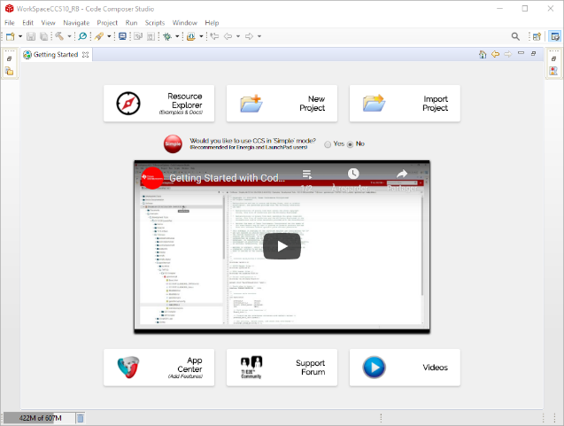

# msp432 Exercises

List all the exercises for the MSP432 Board

## Setup code composer

This software can be downloaded from the TI website: https://www.ti.com/tool/download/CCSTUDIO. The lastest version used for this project is 10.1.0.00010 (11 Jun 2020).

After a successful installation, the following window appears at the start.



Goto `Resource Explorer` to select the board. The MSP432 board can be connected
so that Code Composer Studio can detect it immediately and suggest it.


Install the SDK for the kit used.


## Import the exercise

Each subfolders containg the exercise is a project that can be imported in
the CSS IDE. In `Project Explorer`, right click and select
`Import > CSS Projects`.

Under the tab `Project`, Use Build and Debug to flash the board.

### Build
To build the project, right click on the project name and select "Build". A
console should open and the following message will be displayed:

```

**** Build of configuration Debug for project <name> ****

/home/laptop/ti/ccs1000/ccs/utils/bin/gmake -k -j 8 all -O 
 
gmake[1]: '<name>.out' is up to date.

**** Build Finished ****
```

### Debug
To debug the project, right click on the project name and select "Debug As.."
and use the Code Composer Debug Session. The CSS IDE should change to the Debug
configuration and a console should display:

```
CORTEX_M4_0: GEL Output: Memory Map Initialization Complete
CORTEX_M4_0: GEL Output: Halting Watchdog Timer
CORTEX_M4_0: WARNING   : On MSP432P401R hitting a breakpoint cannot be detected
by the debugger when the device is in low power mode.

Click the pause button during debug to check if the device is held at the
breakpoint.
```

In the `Window` tab, go into `Show View` and add Breakpoints, Registers,
Variables and Dissasembly
